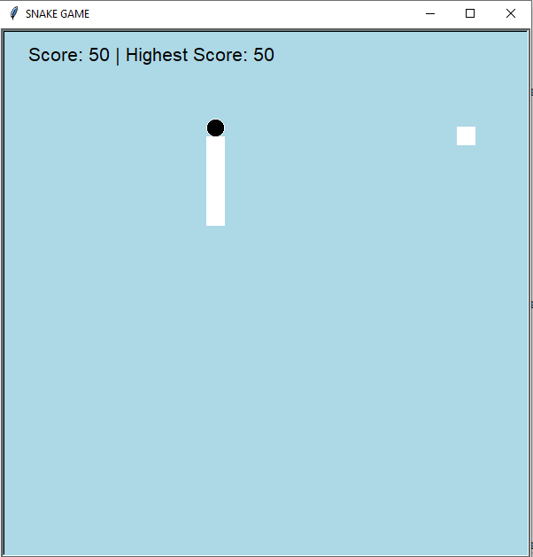

# 🐍 Snake Game - Python Turtle

A fun and simple **Snake Game** created using Python's built-in `turtle` module.

This game demonstrates basic game logic, animation, keyboard controls, collision detection, and score tracking—all without using any external libraries!

---

## 🎮 Gameplay Features

- Move the snake with arrow keys (`↑ ↓ ← →`)
- Eat green food blocks to grow
- Score increases by 10 for each food eaten
- Wrap-around edges (no wall collisions)
- Game Over when the snake hits itself
- Scoreboard with current and high scores
- Press `Space` to stop the snake
- Press `Q` to quit the game

---

## 📸 Screenshot




---

## 🛠️ How to Run

### ✅ Requirements
- Python 3.x (preferably 3.8 or higher)
- No external libraries required

### ▶️ Steps
1. Clone the repository:
   ```bash
   git clone https://github.com/your-username/snake-game-python-turtle.git
   cd snake-game-python-turtle


python snake.py
